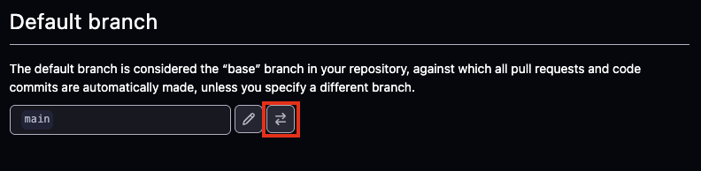
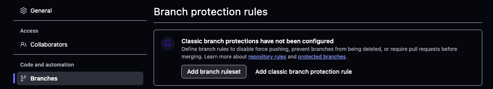
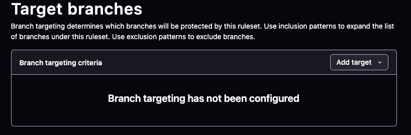

# UV Python Cookiecutter

Basic Python template using [`cookiecutter`](https://github.com/cookiecutter/cookiecutter) and [`uv`](https://docs.astral.sh/uv/).

Objective: make it simpler to set up new Python projects with commonly used developer tooling.

This *should* be platform agnostic and work in DAP.

There are step-by-step installation instructions for [macOS/Linux](https://github.com/communitiesuk/python-cookiecutter-uv/blob/main/docs/unix.md) and [Windows](https://github.com/communitiesuk/python-cookiecutter-uv/blob/main/docs/windows.md) machines.

If you have any issues *and/or* suggestions please contact <jordan.pinder@communities.gov.uk>.

---

## What's included?

- [`uv`](https://docs.astral.sh/uv/) for Python package and dependency management.
- [`pre-commit`](https://pre-commit.com/) ensuring code quality & consistency, prevent commits of sensitive information (e.g. secrets).
- [`ruff`](https://docs.astral.sh/ruff/) for linting and formatting.
- [`ty`](https://github.com/astral-sh/ty) or [`mypy`](https://mypy.readthedocs.io/en/stable/#) for checking type hints.
- [`nox`](https://nox.thea.codes/en/stable/) for automated code quality checks in multiple Python environments.
- [`pytest`](https://docs.pytest.org/) for running unit tests.
- [GitHub Actions](https://github.com/features/actions) for CI workflows.

It also includes pull request and issue templates.

---

## Installation

Assumes you're using a Unix-like system such as a developer Macbook or Linux machine, although there is an [archived Windows installation guide](https://github.com.mcas.ms/communitiesuk/python-cookiecutter-uv/blob/f32daaf05c2f35e1060d18795bf17ff3c9580577/docs/windows.md) which can be revived if needed.

### Step 1: Install tools

The following tools are used:

- [`brew`](https://brew.sh/)
- `uv`
- `pre-commit`

Open a terminal and run the following:

```zsh
/bin/bash -c "$(curl -fsSL https://raw.githubusercontent.com/Homebrew/install/HEAD/install.sh)"
```

Verify the installation:

```zsh
brew --version
```

Then run:

```zsh
brew install uv
brew install pre-commit
```

Verify installations:

```zsh
uv --version
pre-commit --version
```

### Step 2: Configure git

Here we'll configure global credential and a SSH key.

Add your credentials:

```bash
git config --global user.name "your-git-profile"
git config --global user.email "Joe.Bloggs@communities.gov.uk"
```

Generate a SSH key with a passphrase:

```bash
ssh-keygen -t ed25519 -C "your_email@example.com"

```

Start the ssh-agent:

```bash
eval "$(ssh-agent -s)"

```

Depending on your environment, you may need to use a different command. For example, you may need to use root access by running sudo -s -H before starting the ssh-agent, or you may need to use exec ssh-agent bash or exec ssh-agent zsh to run the ssh-agent.

We need to modify the ~/.ssh/config file. Open it with:

```bash
open ~/.ssh/config
```

If it doesn't exist, use:

```bash
touch ~/.ssh/config
```

Modify the content:

```bash
Host github.com
  AddKeysToAgent yes
  UseKeychain yes
  IdentityFile ~/.ssh/id_ed25519
```

***Note***:

- If you chose not to add a passphrase to your key, you should omit the UseKeychain line.
- If you see a Bad configuration option: usekeychain error, add an additional line to the configuration's' Host *.github.com section.

Store the SSH key in the agent:

```bash
ssh-add --apple-use-keychain ~/.ssh/id_ed25519
```

Copy the content of the key:

```bash
pbcopy < ~/.ssh/id_ed25519.pub
```

Then:

1. Go to your [GitHub key settings](https://github.com/settings/keys)
2. Click `New SSH Key`
3. Name `Title` something useful (e.g. `Macbook key`)
4. In `Key type`, `Authentication` should be fine
5. In the `Key`, copy the content of your key
6. Click `Add SSH key`

### Step 3: Set up your GitHub repository

Create an empty repository, for example in the [communitiesuk GitHub organisation](https://github.com/organizations/communitiesuk/repositories/new) or on your profile.

Name your project, e.g. `my-project`.

*DO NOT* check any boxes under the option `Initialize this repository with..`.

### Step 4: Generate your project

On your local machine, navigate to the directory in which you want to create a project, and run the following command:

```bash
uvx cookiecutter git@github.com:communitiesuk/python-cookiecutter-uv.git
```

Follow the onscreen prompts to set your project. This will:

- generate basic information about your project (e.g. author name & email, project URLs)
- prompts for including features (e.g. choosing type hinter, unit testing, include documentation page, target operating system)
- install Python dependencies using the `Makefile`
- configure your initial GitHub repository

***Note***: we use a [flat layout](https://packaging.python.org/en/latest/discussions/src-layout-vs-flat-layout/) by default.

### Step 5: Amend to your preferences

The template gives the option to select different operating systems (`ubuntu`, `macOS`, `windows`).

It defaults to Python versions `3.12` and `3.13`.

If you want to change these manually, amend the following files:

- `~/.github/workflows/main.yml`: lines 13-14
- `~/noxfile.py`: line 14 (if you're using `nox`)

Ensure you commit any changes.

### Step 6: branch protection rules

By default, GitHub does not apply any branch protection policies to newly created repositories. We use policies to enforce best practice like:

- Pull requests into `main` been reviewed & approved
- Pull requests status checks must pass before being merged into `main`
- Default branch is `develop` as opposed to `main`

Open the `Settings` menu for your GitHub repository (your users needs the `Admin` role assigned to them):


Under the `Default branch` section, click on the `Switch to another branch` option and choose the newly created `develop`.



Go to the `Branches` section and click on the `Add branch rules` button:



Under the `Ruleset name`, set this to the relevant branch, e.g. `main`.

Go to the `Target branches` section:



On the `Add target` dropdown, select the option `Include by pattern` and provide your branch name, e.g. `main`.

In the `Branch rules` section, select the following options:

- Restrict deletions
- Require a pull request before merging
  - Required approvals: 1
  - Require approval of the most recent reviewable push
  - Require conversation resolution before merging
- Block force pushes

Repeat the above steps for the `develop` branch.
